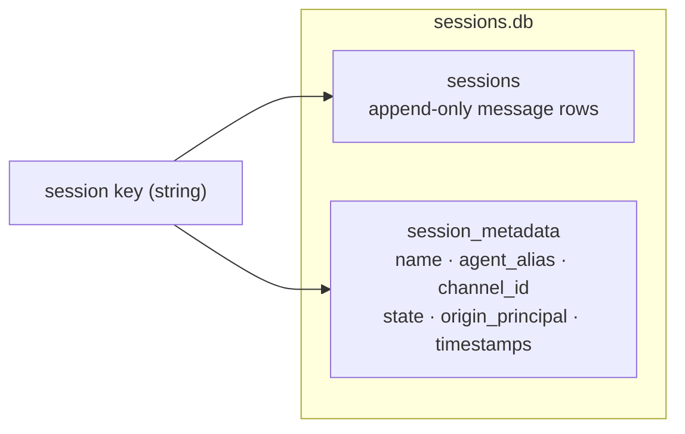
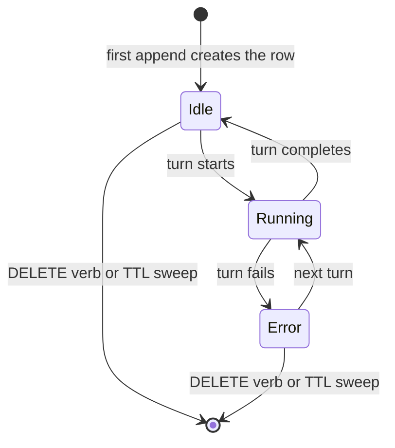

# Session lifecycle

A session is ZeroClaw's unit of conversation continuity: a string key that maps
to append-only message rows plus one metadata row in the unified session store.
There is no "create session" verb anywhere in the system. Writing history under
a new key brings the session into existence; presenting a known key resumes it.

Use this page when a change touches session keys, resume behavior, per-turn
state, session TTLs, or any of the REST/WS/CLI surfaces that read or mutate
sessions. For the wider map of which store owns which state, see
[Runtime state and persistence](./runtime-state-and-persistence.md). For what a
single turn does between "message in" and "reply out", see
[Request lifecycle](./request-lifecycle.md).

## The store

All chat-shaped sessions share one SQLite database:
`<data_dir>/sessions/sessions.db`.

- The contract is the `SessionBackend` trait in
  `crates/zeroclaw-infra/src/session_backend.rs`: load, append/save, list,
  metadata get/set, search, delete, and stale cleanup.
- The default implementation is `crates/zeroclaw-infra/src/session_sqlite.rs`:
  WAL mode, two tables (`sessions` for message rows, `session_metadata` for
  name, agent alias, channel id, per-turn state, origin principal, and
  timestamps), additive `ALTER TABLE`-style migrations, and an FTS5 index for
  transcript search.
- The legacy JSONL implementation lives in
  `crates/zeroclaw-infra/src/session_store.rs` and is still selectable via
  `[channels].session_backend`.
- The factory is `make_session_backend` in `crates/zeroclaw-infra/src/lib.rs`;
  channels, gateway, and RPC all receive the same shared backend instance.

## Session families and keyspaces

Four families of keys coexist. Three live in `sessions.db`; ACP has its own
database and its own protocol semantics.

| Family | Key shape | Minted by | Resumed by |
|---|---|---|---|
| Channel | `<channel>.<agent>_<room>_<sender>`, e.g. `discord.clamps_<room>_<sender>` | `conversation_history_key` in `crates/zeroclaw-channels/src/orchestrator/mod.rs` | Deterministically: the same platform identities always rebuild the same key |
| Gateway WS | `gw_<uuid>` | `crates/zeroclaw-gateway/src/ws.rs` on connect when the client sends no session id | The client echoing the id from the `session_start` frame |
| RPC chat | `rpc_<uuid>` | The RPC chat layer (zerocode) | The RPC client presenting the id |
| ACP | Protocol-defined, in `<data_dir>/sessions/acp-sessions.db` | `crates/zeroclaw-infra/src/acp_session_store.rs` | ACP `session/load` / `session/resume` |

Channel keys are the interesting case: they are derived, not stored anywhere
else, so channel conversations resume "for free" with no handshake. Gateway and
RPC keys are random, so continuity depends on the client holding on to the id.

ACP stays deliberately separate. Its store, resume semantics, and
memory-isolation rules are protocol commitments (see
[ADR-010](./decisions/ADR-010-memory-authority-boundaries.md)), and nothing on
this page applies to `acp-sessions.db` unless it says so explicitly.

## Sessionless surfaces

Several ingress paths intentionally persist no session rows. The common thread:
they are one-shot request/response surfaces with no resume contract, so a
durable transcript would be write-only garbage that still costs retention,
deletion, and privacy review.

| Surface | What the "session id" actually does |
|---|---|
| `POST /webhook` with `X-Session-Id` | The header (validated by `webhook_session_id` in `crates/zeroclaw-gateway/src/lib.rs`) scopes memory recall for the turn. It is a memory scope, not a session key; nothing is appended to `sessions.db`. |
| A2A | Each request carries a per-request `context_id` (`crates/zeroclaw-gateway/src/a2a.rs`). Contexts are the remote agent's continuity problem, not ours. |
| Gateway-hosted webhook channels | `sender_session_id` in `crates/zeroclaw-gateway/src/lib.rs` builds a composite id to scope the turn, but these adapters process each delivery as a one-shot turn. |
| CLI without `--session-state-file` | `zeroclaw agent` keeps history in memory for the process lifetime only. Pass `--session-state-file` to opt into JSONL persistence (`crates/zeroclaw-runtime/src/agent/loop_.rs`). |
| Cron | Scheduled jobs keep due/lock state in `data/cron/jobs.db`. That is scheduler state, not conversation; each run is a fresh turn. |
| Heartbeat | Synthetic self-prompts. Persisting them would pollute every listing surface with machine noise. |

## Lifecycle

- **Creation is implicit.** The first append under a new key creates both the
  message row and the metadata row. There is no create endpoint to gate, which
  is why key derivation and stamping (agent alias, origin principal) happen at
  the transport edge.
- **Resume is a load by key.** The gateway WS handler
  (`handle_socket` in `crates/zeroclaw-gateway/src/ws.rs`) calls
  `backend.load` with the presented id and replays history into the turn
  engine; the channel orchestrator does the same with the derived composite
  key.
- **Per-turn state is metadata.** The WS handler flips the session's state
  between `running`, `idle`, and `error` at turn boundaries. REST reads it via
  `GET /api/sessions/{id}/state`, and `GET /api/sessions/running` lists every
  session currently mid-turn.
- **TTL sweeps prune by family.** See the next section; sweeps hard-delete
  rows, they do not archive.
- **Deletion is not clearing.** `DELETE /api/sessions/{id}` removes the message
  rows and the metadata row: the key is gone from every listing. History
  trimming inside a live turn, by contrast, reshapes what the provider sees
  without touching durability (see
  [Request lifecycle](./request-lifecycle.md)).
- **Deleting a session does not purge memory.** Legacy dual-write paths could
  persist conversation turns into the memory backend as
  `MemoryCategory::Conversation` rows, and curated memory is a separate
  authority by design. Deleting a session deletes continuity only; memory rows
  survive until memory-side deletion or migration handles them. This is the
  boundary [ADR-010](./decisions/ADR-010-memory-authority-boundaries.md)
  formalizes; see also
  [Memory and payload lifecycle](./memory-payload-lifecycle.md).

## Fork surfaces: session threads

Everything below is fork-local (this repository diverges from upstream here;
the delta manifest is `LOCAL-CHANGES.md` at the repository root). The rest of
this page describes behavior shared with upstream.

### Session lifecycle SSE events

Session mutations now emit lifecycle frames onto the shared `/api/events`
broadcast bus (see the
[event stream contract](../gateway/api.md#event-stream-contract)). Emission
lives in `crates/zeroclaw-gateway/src/session_events.rs`; the SSE public
filter in `crates/zeroclaw-gateway/src/sse.rs` admits these frames by their
`source` marker.

The field contract, pinned by tests in `session_events.rs`:

| Field | Value |
|---|---|
| `source` | Always `"sessions"`. This is the filter contract; do not emit session frames without it. |
| `type` | `session_created`, `session_update`, or `session_closed` |
| `session_key` | Full store key (`gw_...`, `rpc_...`, or channel composite) |
| `session_id` | Display id: `gw_` stripped for gateway sessions, full key otherwise |
| `timestamp` | RFC 3339 time of the mutation |
| `agent_alias` | Owning agent; omitted when not stamped |
| `name` | User-assigned name; omitted until renamed |
| `message_count` | Row count at emission time; omitted when metadata is missing |
| `state` | `idle` / `running` / `error`; omitted when unknown |

The first five fields are always present; the rest are omitted (not `null`)
when unknown. Frames carry session metadata only, never message content:
`/api/events` is the public stream, and the metadata-only rule is what makes
admitting `source == "sessions"` frames safe.

The web dashboard subscribes to exactly these three types
(`web/src/pages/Dashboard.tsx`), so thread listings update without polling.

### REST verb parity for non-`gw_` keys

Every `/api/sessions/{id}` verb resolves the id the same way: try the id
verbatim as a store key, then `gw_<id>`, then `rpc_<id>`. This replaces the
old per-handler behavior where rename, state, and abort hard-coded the `gw_`
prefix and the messages handler guessed from whether the id contained an
underscore. Channel and RPC sessions get the full verb set.

### Hourly scoped TTL sweeps

TTL enforcement runs as an hourly sweep in the gateway, scoped by key family:

| Knob | Sweeps | Default |
|---|---|---|
| `gateway.session_ttl_hours` | `gw_` rows only | `0` (disabled) |
| `channels.session_ttl_hours` | Channel-composite rows only | `0` (disabled) |

`0` disables the corresponding sweep. `rpc_` rows and the ACP store are never
TTL-swept. Upstream applies `gateway.session_ttl_hours` exactly once at
startup as an unscoped delete of every stale row and never reads the channels
knob; both behaviors change here.

### Origin principals and resume guards

- Sessions are stamped with an `origin_principal` metadata column on first
  append: for gateway WS clients this is the auth subject derived in
  `crates/zeroclaw-gateway/src/ws.rs` (SHA-256 of the presented bearer token,
  as used for SOP approvals). With a flat paired-token set and no account
  model, this is the closest available notion of "owner".
- Resuming a WS session whose stamped `agent_alias` differs from the
  connecting agent is refused unless the client passes `adopt=true`.
  Previously the connect path re-stamped the alias unconditionally, silently
  reassigning threads between agents.
- `gateway.scope_sessions_to_device` (default `false`) restricts session
  listing and resume to sessions whose `origin_principal` matches the calling
  token. Off by default because upstream semantics are "any paired device sees
  every session".

### Web threads UI

The dashboard chat gains a threads panel
(`web/src/components/ThreadsPanel.tsx`): list, switch, rename, and delete
sessions per agent, live-updated from the SSE lifecycle events. The `/new`
slash command now starts a fresh thread under a new `gw_` key and leaves the
previous thread listed; upstream's `/new` deleted the current session.

### `zeroclaw sessions` CLI

`src/sessions_cli/` adds a first-class CLI over the same backend: list
sessions across families, show a transcript, search transcripts (FTS5),
rename, and delete. User-facing text goes through Fluent
(`crates/zeroclaw-runtime/locales/en/cli.ftl`), matching the CLI text policy.

## Where it lives in code

- Backend contract and implementations:
  `crates/zeroclaw-infra/src/session_backend.rs`,
  `crates/zeroclaw-infra/src/session_sqlite.rs`,
  `crates/zeroclaw-infra/src/session_store.rs`, factory in
  `crates/zeroclaw-infra/src/lib.rs`
- Channel key derivation: `conversation_history_key` in
  `crates/zeroclaw-channels/src/orchestrator/mod.rs`; store wiring in
  `start_channels`
- Gateway WS lifecycle: `crates/zeroclaw-gateway/src/ws.rs`
- REST session handlers: `crates/zeroclaw-gateway/src/api.rs`; routes in
  `crates/zeroclaw-gateway/src/lib.rs`
- SSE lifecycle events: `crates/zeroclaw-gateway/src/session_events.rs`,
  filter in `crates/zeroclaw-gateway/src/sse.rs`
- TTL knobs: `gateway.session_ttl_hours` and `channels.session_ttl_hours` in
  `crates/zeroclaw-config/src/schema.rs`
- ACP store (separate): `crates/zeroclaw-infra/src/acp_session_store.rs`

## Related pages

- [Runtime state and persistence](./runtime-state-and-persistence.md): which
  store owns which state
- [Request lifecycle](./request-lifecycle.md): what happens inside one turn
- [Memory and payload lifecycle](./memory-payload-lifecycle.md): history
  versus memory ownership
- [ADR-010](./decisions/ADR-010-memory-authority-boundaries.md): conversation
  history, curated memory, and enrichment authority
- [Gateway HTTP API](../gateway/api.md): the REST surface over sessions
